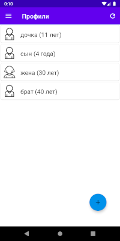
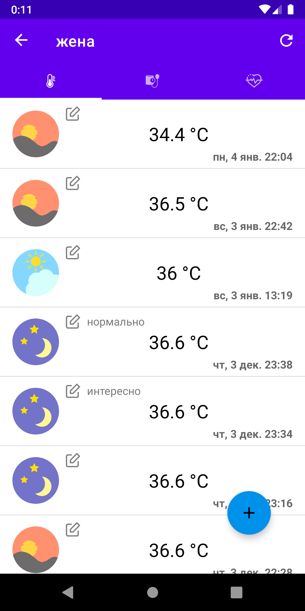
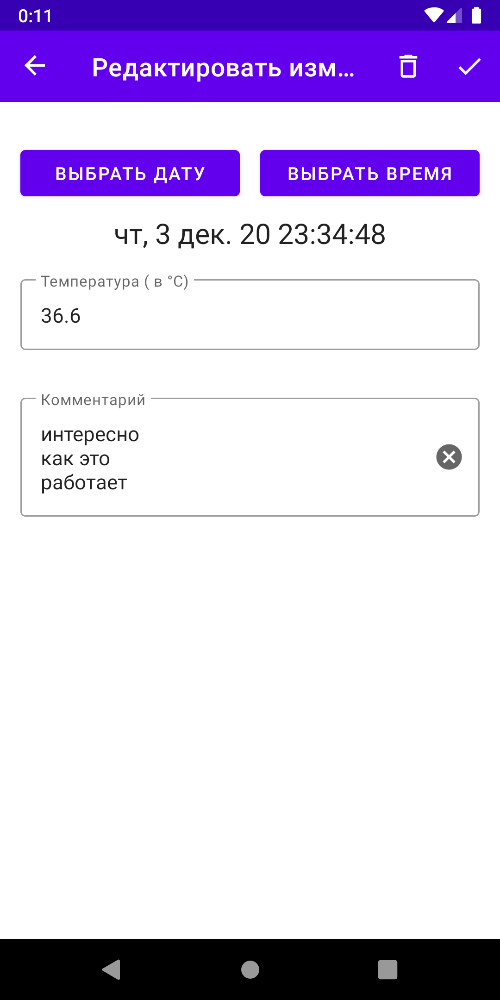

# Дневник здоровья (HealthDiary)

## Несколько скринов программы:
  

Дневник для сохранения измерений важных показателей здоровья. 
Многопользовательское приложение, которое позволяет сохранять основные показатели здоровья человека.
К таким показателям относятся:
+ температура
+ давление
+ пульс
+ сахар в крови
+ сатурация 
и другие

## Основные возможности:
+ личный кабинет пользователя
+ создание списка наблюдаемых (профилей), людей для которых сохраняются показатели (измерения)
+ создание общих профилей для нескольких пользователей
+ ввод/изменение выбранного измерения
+ просмотр раннее введенных измерений списком и на графике

## Стек технологий:
+ Kotlin
+ Dagger 2
+ MVVM
+ Coroutine
+ Android Navigation
+ Architecture Components (Room для локального кеша данных)
+ Retrofit

## Серверная часть:
+ Django
+ DRF (Django REST Framework)
+ SQLite (используется на этапе разработки, т.к. ORM то потом можно выбрать MySQL или Postrges)

## Список экранов:
+ Регистрация/авторизация пользователя
+ Предоставление доступа одним пользователям к профилям других
+ Настройки типов измерений
+ Добавить/редактировать измерение
+ Просмотр измерений списком/графиком
