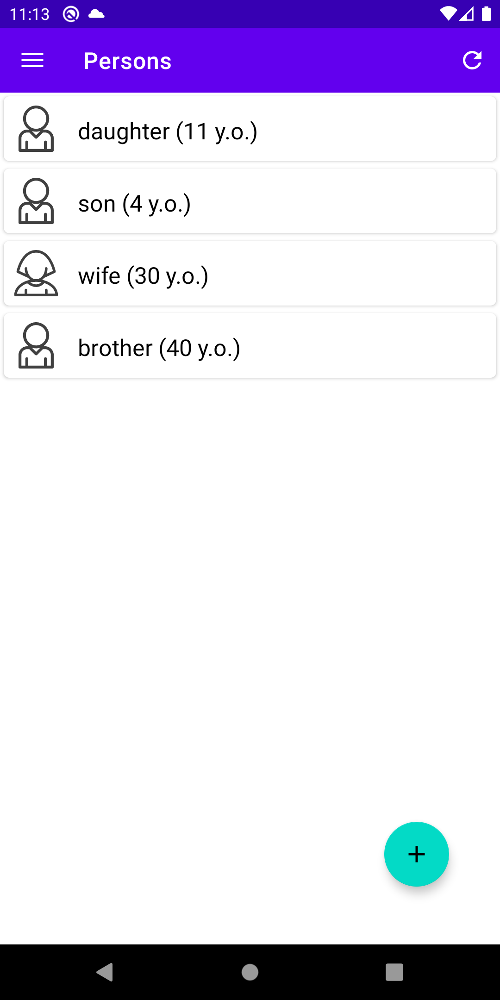
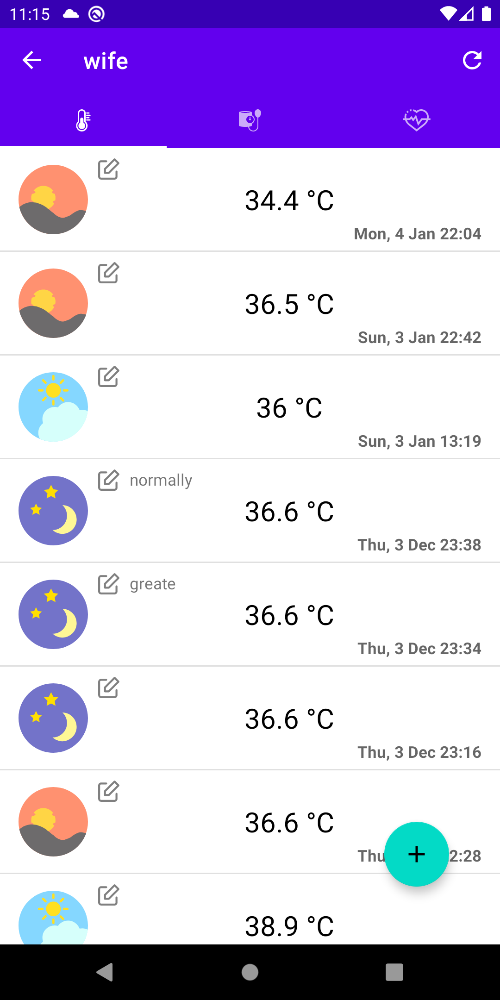
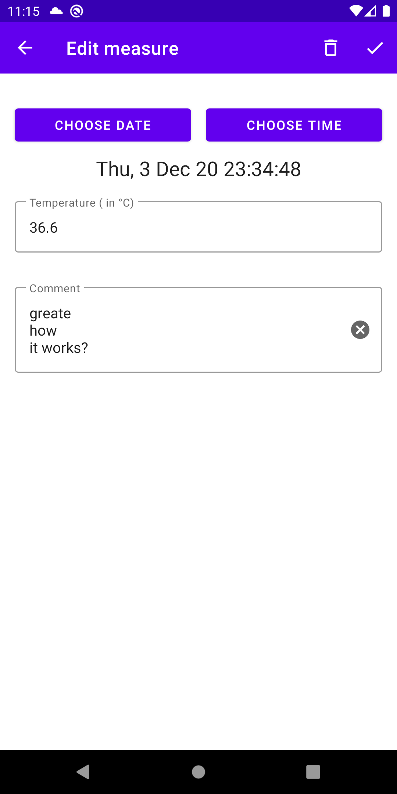

# HealthDiary

*Read this in other languages: [English](README.md), [Русский](README.ru.md).*

## Screenshots:
  

Diary for saving measurements of important health indicators. 
A multi-user application that allows you to save the main indicators of human health.
Namely:
+ temperature
+ pressure
+ pulse
+ blood sugar
+ saturation 
and others

## Key features:
+ user's personal account
+ creating a list of profiles, people for whom measurements are saved
+ creating common profiles for multiple users
+ enter/change the selected dimension
+ viewing previously entered measurements in the list

## Architectural solution:
+ multi-module application with "clean architecture" inside each module
+ single source of truth (SSOT) is a local SQLite database using Room framework
+ using static code analyzer [Detekt](https://github.com/detekt/detekt)
+ using plugin for calculate code coverage based on [JaCoCo](https://github.com/jacoco/jacoco)
+ using unit and instrumental tests ONLY one module (feauture) for example
+ writing to demonstratesome custom rules for Lint 
+ added CI script for [Jenkins](https://www.jenkins.io/)

## Technology stack:
+ Kotlin
+ Dagger 2
+ MVVM
+ Coroutine
+ Android Navigation
+ Architecture Components (Room for local cache)
+ Retrofit

## Backend:
+ Django
+ DRF (Django REST Framework)
+ SQLite (used at the development stage, then you can choose MySQL or Postrges)

## Screen lists:
+ User registration/authorization
+ Granting access to one user to the profiles of others
+ Measurement type settings
+ Add/edit dimension
+ Viewing measurements in a list
